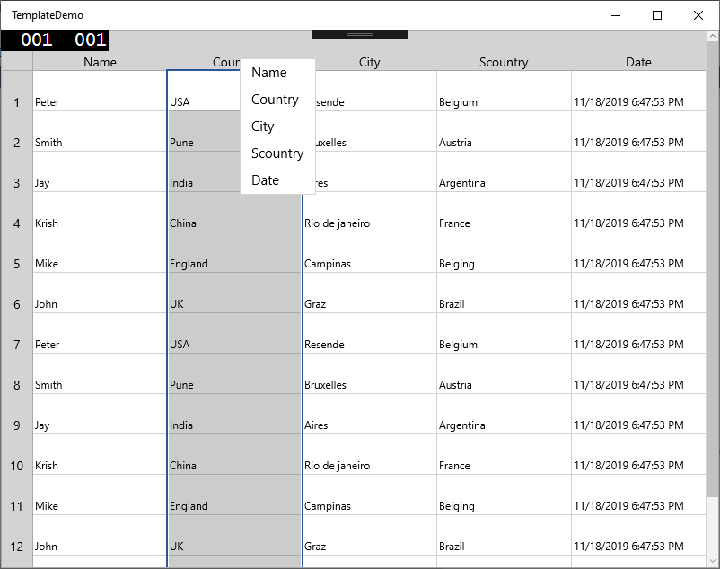

# How to Add Different Context Menu for Each Cells in UWP CellGrid?

This example demonstrates how to add different context menu for each cells in [UWP CellGrid](https://help.syncfusion.com/uwp/cellgrid/overview) (SfCellGrid).

To load different `ContextMenu` items for different cells, the [CellContextMenuOpening](https://help.syncfusion.com/cr/uwp/Syncfusion.UI.Xaml.CellGrid.SfCellGrid.html#Syncfusion_UI_Xaml_CellGrid_SfCellGrid_CellContextMenuOpening) event can be customized. In that event, the [CellContextMenu](https://help.syncfusion.com/cr/uwp/Syncfusion.UI.Xaml.CellGrid.Helpers.CellContextMenuOpeningEventArgs.html#Syncfusion_UI_Xaml_CellGrid_Helpers_CellContextMenuOpeningEventArgs_CellContextMenu) property can be used to assign the custom menu items.

``` csharp
//Event subsciption
grid.CellContextMenuOpening += CellGrid_CellContextMenuOpening;
 
//Event customization
private void CellGrid_CellContextMenuOpening(object sender, CellContextMenuOpeningEventArgs e)
{
    if (e.Cell.ColumnIndex == 0 && e.Cell.RowIndex > 0) 
        e.CellContextMenu = GetRowCellMenu(); //Gets context menu items for rows.
    else if (e.Cell.RowIndex == 0 && e.Cell.ColumnIndex > 0)
        e.CellContextMenu = GetColumnCellMenu();// Gets context menu items for columns
    else
        e.CellContextMenu = GetCellContextMenu(); //// Gets context menu items for Cells
}
 
private ContextMenu GetCellContextMenu()
{
    ContextMenu contextMenu = new ContextMenu();
    for (int i = 0; i < 5; i++)
    {
        MenuFlyoutItem query = new MenuFlyoutItem { Text = string.Format("Cell{0}", i), Height = 50, VerticalAlignment = VerticalAlignment.Center };
        contextMenu.Items?.Add(query);
    }
    return contextMenu;
}
```

